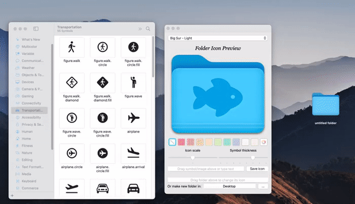

<!-- PROJECT LOGO -->
 

  
  <h1>Fancy Folders</h1>

**Fancy Folders** is a macOS application for creating customized folder icons from SF symbols, text, or images.

- Drag and drop to set the icon and output folder
- Customize the icon scale, thickness, and colour
- Save the icon!

## Get started

<h3><a href="https://github.com/kfreitag1/FancyFolders/releases/latest/download/FancyFolders.dmg">:floppy_disk: Download latest Fancy Folders release</a></h3>

_**Note:** Please follow the first launch instructions in order to use the app. This is needed for all apps produced by [unidentified developers](https://support.apple.com/en-ca/guide/mac-help/mh40616/mac), i.e. those without Apple developer accounts._

<h3><a href="https://developer.apple.com/sf-symbols/">:floppy_disk: Download latest SF Symbols</a></h3>

## Features

- Drag to set icon

  - From the **SF Symbols** app _(recommended)_
  - From an image (eg. from Google images)
  - From an image file (eg .jpg or .png file)
  - Type in text in the input field

- Drag to set the output folder

- Choose a folder tint colour from the list or select a custom colour

- Click "Save Icon" to save the folder to the output folder, or to make a new folder with the icon in the chosen directory

## Licence

Fancy Folders is released under the [GPL v3 Licence](https://www.gnu.org/licenses/gpl-3.0.en.html). Fonts used in this project and the SF symbols app are the property of Apple and are not included within this licence.

## Special thanks

My lovely girlfriend Kelsey who had to put up with me while I made this :heart:
